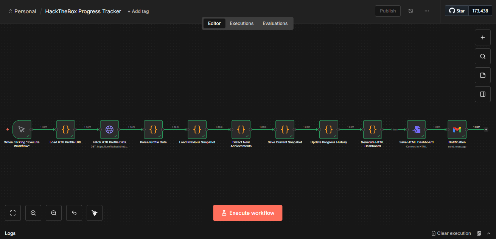

# HackTheBox Progress Tracker

> Automated HTB profile tracker using n8n to monitor machine completions, calculate statistics, and generate interactive achievement dashboards

[](LICENSE)
[](https://n8n.io)



---

## Table of Contents

- [Overview](#overview)
- [Features](#features)
- [Demo](#demo)
- [Prerequisites](#prerequisites)
- [Installation](#installation)
- [Usage](#usage)
- [Dashboard](#dashboard)
- [Sample Data](#sample-data)
- [Troubleshooting](#troubleshooting)
- [License](#license)

---

## Overview

**Problem:** CTF players and penetration testers manually track their HackTheBox progress across dozens of machines. There's no automated way to monitor completions, visualize skill progression, or get notified of new achievements.

**Solution:** This n8n workflow scrapes your HTB public profile page, extracts machine completion data, compares with previous snapshots to detect new achievements, stores historical progress in JSON format, and generates an interactive HTML dashboard with charts and statistics.

**Technology:**
- n8n (workflow automation)
- Web scraping (HTML parsing - no API key needed)
- JSON data storage (local file system)
- Chart.js (interactive visualizations)
- Notification integrations (Slack/Discord/Email)

**Use Cases:**
- Personal progress tracking
- Team leaderboard creation
- Achievement notifications
- Skill progression visualization
- Portfolio showcase for job applications

---

## Features

- **Automated profile scraping** - Monitors HTB public profile
- **Completion tracking** - Detects newly owned machines
- **Historical data** - Stores progression over time
- **Interactive dashboard** - Charts, tables, and statistics
- **Difficulty breakdown** - Easy/Medium/Hard/Insane stats
- **Achievement notifications** - Slack/Discord/email alerts for new completions
- **Export capabilities** - JSON/CSV/HTML data export
- **No API required** - Uses public profile scraping

---

## Demo

### Audio Case Study (Coming Soon)
Full walkthrough available after workflow build.

### Visual Demo


---

## Prerequisites

**Required:**
- **n8n instance** (self-hosted or cloud)
- **HackTheBox account** with public profile

**Optional:**
- **Slack/Discord/Email** for notifications
- **Web server** to host dashboard

---

## Installation

### Quick Start: Import Workflow (5 minutes)

1. **Download workflow:**
   - [Releases](https://github.com/Dessybabybaby/htb-progress-tracker/releases)
   - Download `htb-tracker-workflow.json`

2. **Import to n8n:**
   - Workflows → Import from File

3. **Configure profile:**
   - Edit "Load HTB Profile URL" node
   - Set your HTB user ID

4. **Execute workflow:**
   - Click "Execute Workflow"
   - Dashboard generated at `dashboard.html`

5. **Schedule automated tracking:**
   - Replace Manual Trigger with Schedule Trigger (weekly)
   - Activate workflow

---

## Usage

### Setting Your HTB Profile

**Find your HTB User ID:**
1. Go to: https://app.hackthebox.com/profile/[YOUR_ID]
2. Your user ID is the number in the URL
3. Example: `https://app.hackthebox.com/profile/123456` → User ID = `123456`

**Configure workflow:**
- Edit "Load HTB Profile URL" node
- Update user ID in the code

### Running Tracker

**Manual Execution:**
1. Open workflow
2. Click "Execute Workflow"
3. View dashboard: `dashboard.html`

**Scheduled (Weekly):**
1. Add Schedule Trigger (Sunday 11:59 PM)
2. Activate workflow
3. Get weekly progress updates

### Dashboard Features

**Statistics:**
- Total machines pwned
- User/Root flags captured
- Average difficulty rating
- Completion rate by OS (Windows/Linux)

**Charts:**
- Progress over time (line chart)
- Difficulty distribution (pie chart)
- Monthly completions (bar chart)

**Tables:**
- Recent completions (last 10)
- All machines (sortable)
- Personal bests

---

## Dashboard

### Example Dashboard

**Sections:**

**1. Overview Cards**
```
┌─────────────┬─────────────┬─────────────┬─────────────┐
│ 42 Machines │ 84 Flags    │ 28 Days     │ 65% Linux   │
│ Owned       │ Captured    │ Avg Time    │ 35% Windows │
└─────────────┴─────────────┴─────────────┴─────────────┘
```

**2. Progress Timeline**
- Line chart showing cumulative machines over time

**3. Difficulty Breakdown**
- Pie chart: Easy (30%), Medium (45%), Hard (20%), Insane (5%)

**4. Recent Completions**
| Machine | Difficulty | OS | Date | Flags |
|---------|-----------|-----|------|-------|
| Photobomb | Easy | Linux | 2026-01-15 | User, Root |
| MetaTwo | Medium | Linux | 2026-01-12 | User, Root |

---

## Sample Data

### Test Files

**`sample-data/htb-profile-snapshot.json`** - Sample profile data (20 machines)

**`sample-data/dashboard-sample.html`** - Expected dashboard output

**`sample-data/progress-history.json`** - Historical tracking data

### Running Test

1. Download sample data
2. Place `htb-profile-snapshot.json`
3. Execute workflow
4. Compare output with `dashboard-sample.html`

---

## Troubleshooting

| Issue | Solution |
|-------|----------|
| **Profile not found** | Verify user ID is correct; check profile is public |
| **Scraping fails** | HTB may have changed HTML structure; update selectors |
| **No new completions** | Working as expected - only shows changes since last run |
| **Chart not rendering** | Check browser console; verify Chart.js CDN loaded |
| **Old data not loading** | Verify `htb-progress.json` exists and is readable |

**Enable Debug Mode:**
```javascript
// Add to any Code node:
console.log('Debug:', JSON.stringify(data, null, 2));
```

---

## Privacy & Ethics

### Important Notes

**This tool scrapes PUBLIC profile data only.**

**Permitted:**
- Tracking your own HTB progress
- Creating team leaderboards (with consent)
- Generating portfolio dashboards

**Not Permitted:**
- Scraping private profile data
- Excessive requests (respect rate limits)
- Tracking users without consent

**Best Practices:**
- Limit scraping to once per week
- Use public profiles only
- Cache data to minimize requests
- Respect HTB Terms of Service

---

## License

MIT License - see [LICENSE](LICENSE)

---

## Acknowledgments

- Inspired by [Mad Hat](https://youtube.com/@MadHat) - CTF and pentesting content
- Built with [n8n.io](https://n8n.io)
- Data provided by [HackTheBox](https://www.hackthebox.com)
- Dashboard powered by [Chart.js](https://www.chartjs.org)

---

## Contact

**Creator:** [Achusi Desmond]
- Portfolio: [My Story](https://Dessybabybaby.github.io/portfolio-site)
- GitHub: [Dessybabybay](https://github.com/Dessybabybaby)
- LinkedIn: [Achusi Desmond](https://linkedin.com/in/achusi-desmond)

---

**If this helps track your HTB journey, please star the repo!**
